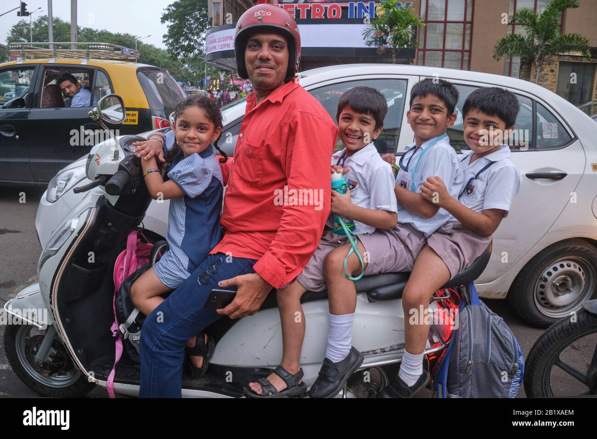
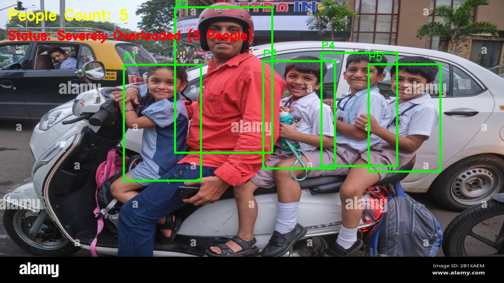
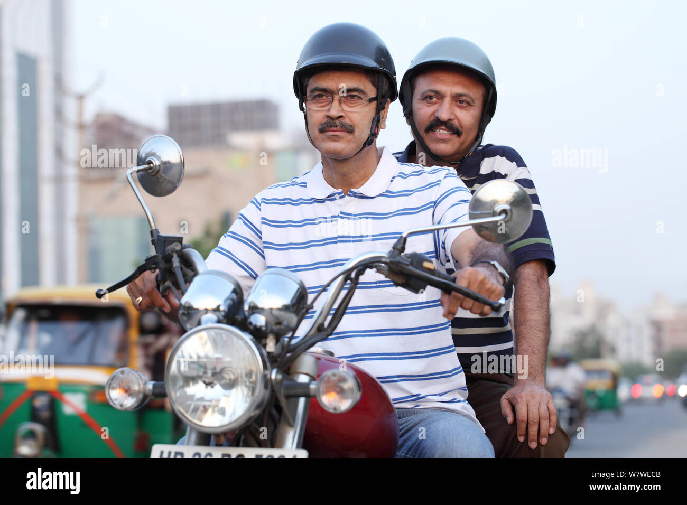
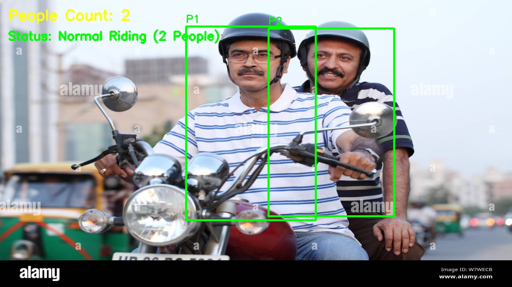
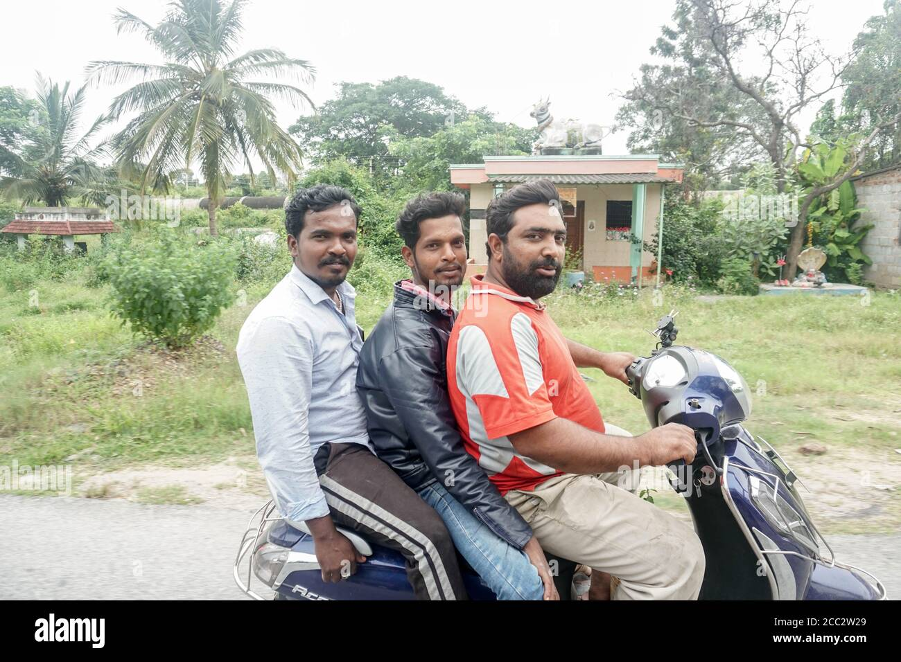
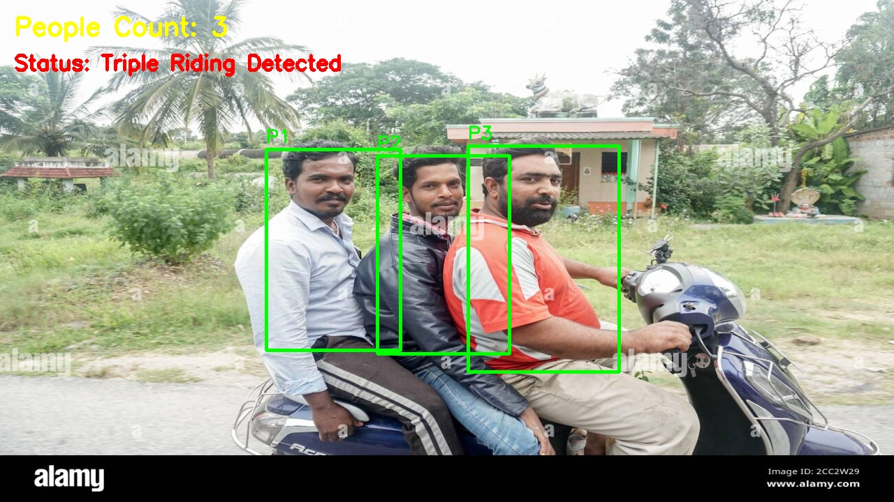

# 🛵 Two-Wheeler Rider Count and Overloading Detection using Computer Vision

## What does this project do?

In many parts of the world, riding a two-wheeler (like a motorcycle or scooter) with more than two people is a dangerous traffic violation—often called "triple riding" or "overloading."

This project acts as an automatic traffic observer! You give it a picture of a bike, and it will:
1. **Look** for the people sitting on the vehicle.
2. **Count** how many people there are.
3. **Decide** if there is a violation: returning "Normal Riding" (1 or 2 people) or raising an alarm like "Triple Riding Detected" or "Severely Overloaded" (for 4+ people).

### 📸 Before & After Examples
Here are three examples showing what the original pictures look like, compared to the final results where the computer identifies and counts the riders:

#### Example 1: Severely Overloaded (5 People)
**Before (Original Input):**



**After (Processed Output):**



#### Example 2: Normal Riding (2 People)
**Before (Original Input):**



**After (Processed Output):**



#### Example 3: Triple Riding Detected (3 People)
**Before (Original Input):**



**After (Processed Output):**



---

## How does it work? (Explained for Beginners!)

You don't need a math degree or an Artificial Intelligence background to understand this. Here is the step-by-step "magic" happening behind the scenes, explained in simple English:

### Step 1: Making the Image Easy to Read (Preprocessing)
First, the computer strips away all the colors from the image (making it black and white) and adjusts the lighting contrast. This makes it much easier for the computer to focus on important shapes and shadows without getting confused by bright, colorful clothes or neon signs.

### Step 2: The "Face Hunt" (Detection)
Instead of trying to find whole human bodies—which is very difficult when people are squeezed together on a small scooter—we look for **faces**! 

We use an old-school but highly effective tool called a **Haar Cascade**. Think of it as a transparent stencil that the computer slides across the image. It looks for a specific pattern of light and dark pixels that usually make up two eyes, a nose, and a mouth. We use two different stencils:
- One for **front-facing** people.
- One for **side-facing** people (a profile).

### Step 3: Throwing Away Mistakes (Filtering)
Sometimes, a pattern on a plaid shirt, a cluster of leaves, or a person sitting in a car in the background might accidentally match our "face stencil." We use simple, clever rules to throw out these mistakes:
- **The Size Rule:** If a "face" is way too tiny (like a pebble) or way too huge (taking up the whole screen), it's probably a mistake. We ignore it.
- **The Location Rule (Region of Interest):** People sitting on a bike will almost always have their heads in the **top half** of the picture. So, we tell the computer to completely ignore any "faces" it finds near the wheels, legs, or the road!

### Step 4: From Faces to Bodies (Expansion)
Once we are confident we have found a face, we can make a very safe guess about where the rest of the person's upper body is! The code automatically draws a larger rectangle that starts at the face and expands downward to cover the person's chest and shoulders.

### Step 5: Counting and Deciding
Finally, we carefully count the number of body rectangles we drew.
- **1 or 2 rectangles:** We print "**Normal Riding (2 People)**" in bright green.
- **3 rectangles:** We print "**Triple Riding Detected**" in warning red.
- **4 or more rectangles:** We print "**Severely Overloaded**" in warning red.

---

## How to Use This Project?

You need **Python** installed. Follow these quick steps in your terminal or command prompt:

### 1. Setup
Open your terminal, navigate to the project folder, and run:

**For Windows:**
```cmd
python -m venv venv
venv\Scripts\activate
pip install -r requirements.txt
```

**For Mac / Linux:**
```bash
python3 -m venv venv
source venv/bin/activate
pip3 install -r requirements.txt
```

### 2. Run
1. Put any bike pictures you want to test into the `input/` folder.
2. Run the script:
   ```bash
   python main.py
   ```
3. Check the `output/` folder to see the results with green boxes and passenger counts!

---

## Limitations (When might it get confused?)
No system is perfect, especially simple ones! Here are a few real-world things that might trick the detector:
- **Full-Face Helmets:** If a rider is wearing a dark, fully-closed helmet with the visor down, the "face stencil" won't be able to see their eyes and nose, so they might not be counted.
- **Looking Away:** If someone has their back completely turned to the camera, the computer can't see their face to count them.
- **Very Blurry Images:** If the picture is taken at high speed on a bumpy road, the shapes become too smudged for the computer to recognize the "face" pattern.

---

## A Note for Absolute Beginners
This project does *not* use heavy, complicated "Deep Learning" or massive "AI Neural Networks" that require expensive computers and graphics cards. 

Instead, it uses **"Classical Computer Vision"**—which basically means we are using smart, lightweight pixel math and logical rules. It’s light, fast, and a perfect first step into the amazing world of teaching computers how to see!

---

## 🌍 Conclusion: Where Can This Be Used?

This project is more than just a fun coding experiment; it shows the foundational logic behind real-world systems! Similar computer vision concepts are actively used today in:
- **Smart City Traffic Cameras:** Automatically monitoring busy intersections, flagging overloaded vehicles, and generating automatic traffic tickets for safety violations.
- **Toll Booth Monitoring:** Identifying vehicle occupancy and load limits quickly as they pass.
- **Road Safety Analytics:** Helping city planners and police departments gather automatic data on how often people break local riding rules, so they know where to deploy patrols.

It's a small but powerful example of how giving a computer "automatic eyes" can help build safer communities and smarter cities!
